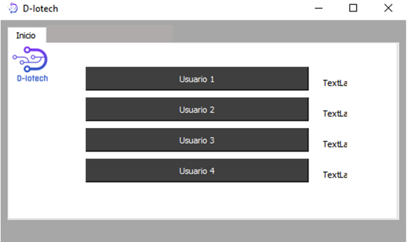
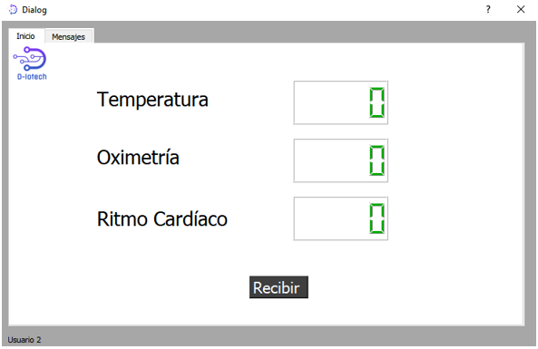
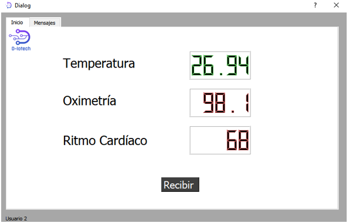
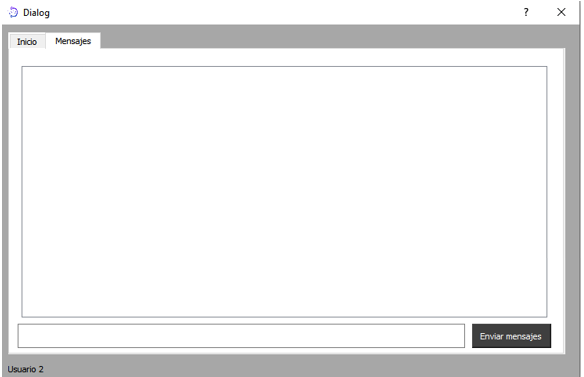
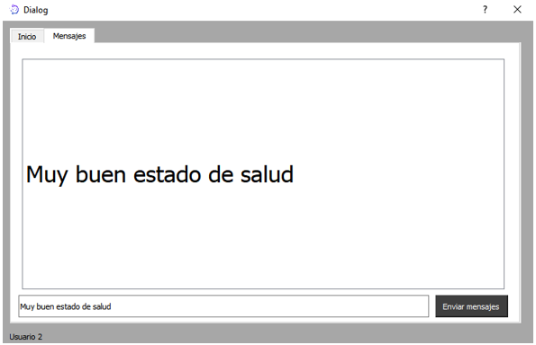

# User Manual for the Doctor's Application

When running the doctor's program, you'll be greeted with the initial screen showcasing various user interfaces.

Upon selecting a user, a pop-up window will open for the respective user, where they will find themselves on the "Home" tab.

Afterward, the doctor will press the "Receive" button to extract the data from Thinspeak and display it on the screen. If the data is within normal levels, it will appear in green; otherwise, it will appear in red.

Then, the message tab is displayed, where the doctor will send the relevant information to the corresponding user.

The doctor will press the "Send Message" button, and the information will be sent to the user and displayed on the screen what they wrote.

