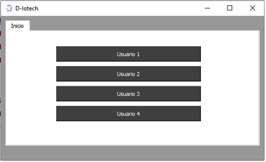
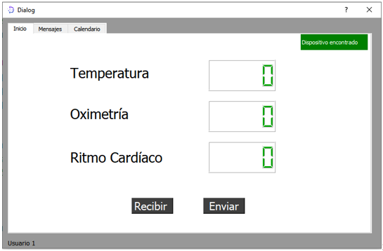
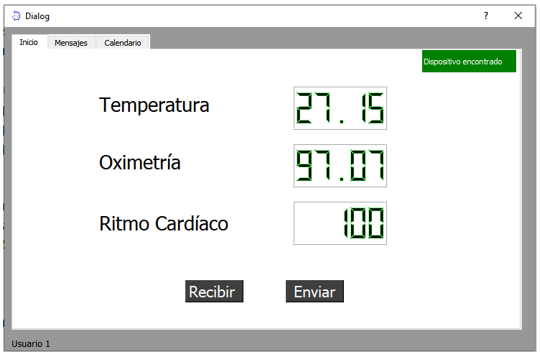
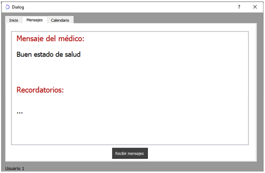
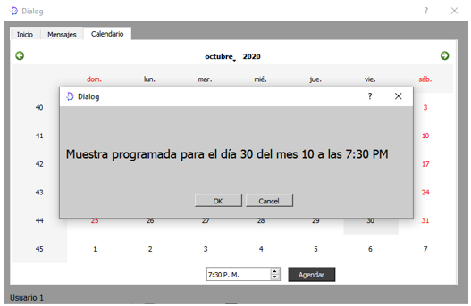
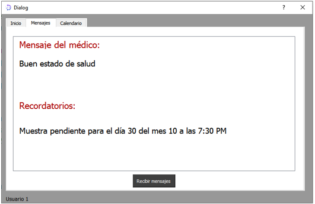

# User's application manual

The following app allows you to receive data from the sample collection and later upload it to the cloud for the doctor to receive and examine. Then, the assigned user is selected as follows:

| |  |
|:---:|:---:|

The user logs in, in this case, user1 (bottom left), and checks if the device is connected. For confirmation, a green button will appear indicating "device found". If the system does not detect the device, a red "device not found" window will appear (top right).

To receive the data from the signal capture, click on "receive", and then you need to send the data by clicking on "send".

In the Messages window, you will find the messages received from the doctor and the reminders scheduled for sample collection. To receive a message, click on the "Receive Message" button (bottom part).

To schedule a reminder for signal collection, click on the Calendar and select the month using the arrows located at the top. Similarly, set the desired time at the bottom. To finish, click on "Schedule" to confirm the reminder.

Once a reminder has been scheduled, a window will appear to confirm the scheduled sample collection. To save, click on "OK". You will then return to the Messages window, where the previously scheduled reminder will be confirmed.

